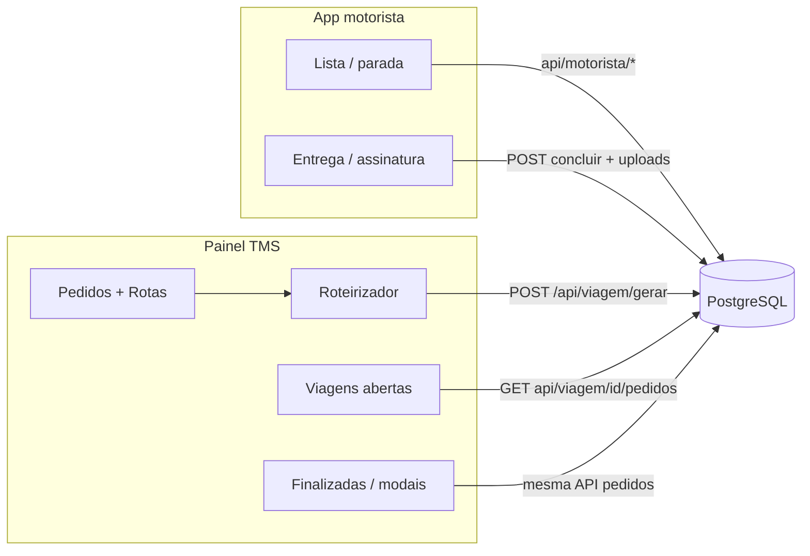
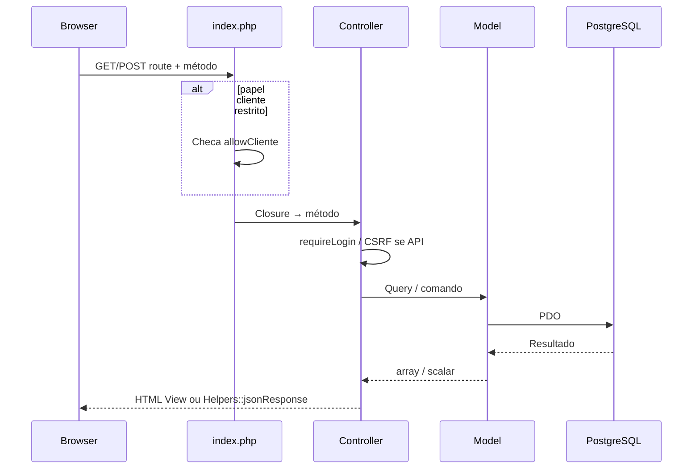
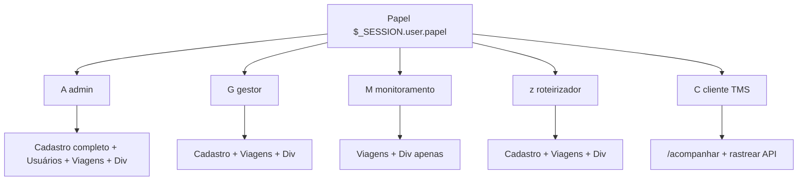
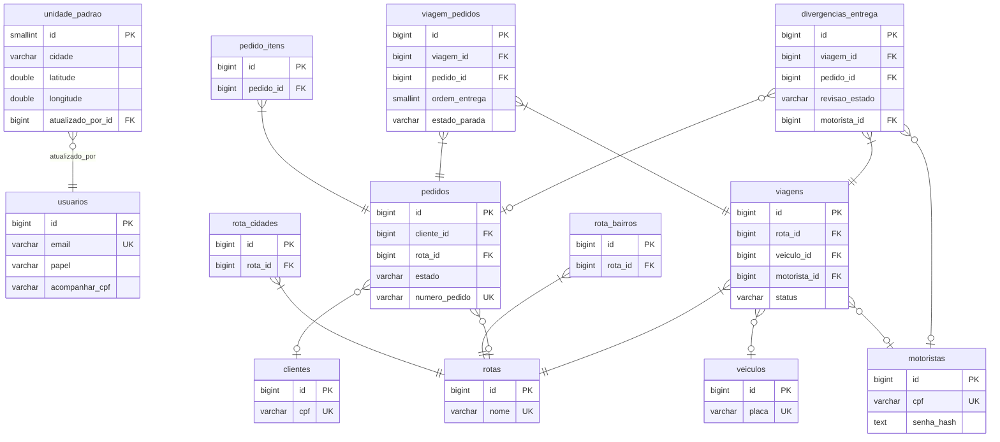
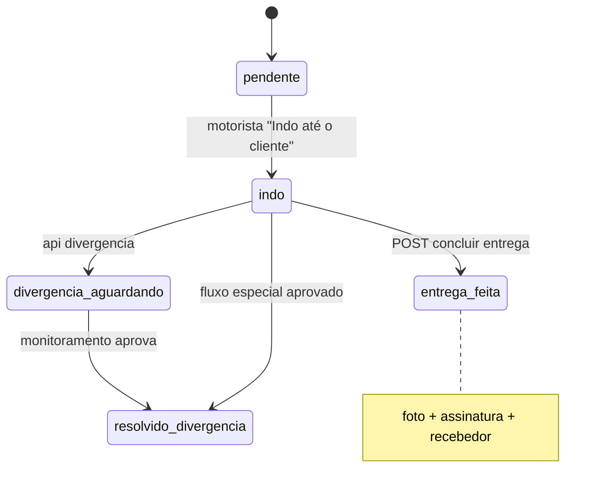

# LogBrasil TMS — Documentação técnica

Documentação orientada a desenvolvedores e operações: **fluxo das telas**, **arquivos envolvidos**, **rotas/APIs** e **como as funções são realizadas**.

---

## 1. Visão geral da arquitetura

### 1.1 Entrada HTTP

| Item | Função |
|------|--------|
| `public/index.php` | Ponto único de entrada; lê `$_GET['route']` como caminho (`/pedidos`, `/motorista`, etc.). |
| `app/bootstrap.php` | Carrega `config.php`, inicia sessão (`SESSION_NAME` no `.env`), registra autoload PSR-4-like (`App\` → `app/`). |
| `App\Core\Router` | Faz _match_ de método HTTP + regex do path e invoca closures que instanciam controladores. |
| Middleware implícito | Antes do router: usuário `papel=cliente` só pode `/acompanhar`, `/logout` e `/api/cliente/rastrear` (ver bloco em `public/index.php`). |

### 1.2 Padrão MVC (PHP)

| Camada | Pasta / convenção |
|--------|---------------------|
| **Controllers** | `app/Controllers/*.php` — HTTP, permissões (`requireLogin`, `requirePapel`, `denyUnlessCsrf`), chamada a Models e Views. |
| **Models** | `app/Models/*.php` — SQL via `App\Core\Database::pdo()` (PostgreSQL). |
| **Views** | `resources/views/**/*.php` — HTML/PHP; layout `layouts/main.php` (painel interno), `layouts/guest.php` (login), etc. |
| **Core** | `app/Core/` — `Helpers`, `Router`, `View`, `Database`, `Controller`. |
| **Config** | `app/config/config.php` + variáveis `.env` (`CONF_BASE_URL`, DSN DB, etc.). |

### 1.3 Front-end compartilhado (painel)

| Artefato | Uso |
|----------|-----|
| `public/assets/js/logbrasil.js` | `window.LOGBR` (`baseUrl`, `csrf`); `lbJson()` envia **`_csrf` no JSON** em POST/PATCH com corpo objeto; máscara de “ocupado” (`#lb-busy-mask`). |
| `public/assets/css/logbrasil.css` | Estilo principal do TMS. |
| `resources/views/layouts/main.php` | Injeta `<meta name="csrf">`, ``, carrega `logbrasil.js`. |

### 1.4 Diagramas (Mermaid)

Os blocos seguintes podem ser visualizados em qualquer viewer Markdown com suporte a Mermaid (GitHub, GitLab, VS Code com extensão, etc.).

#### Pedido até entrega — visão macro

#### Requisição única ao servidor

#### Menu do painel por papel (resumo)

#### Modelo de dados principal (trecho relevante ao fluxo viagem–entrega)

Relações alinhadas a `database/schema.sql` (não lista todas as colunas).

*Nota:* `divergencias_entrega` também referencia **`usuarios`** em `origem_usuario_id` e `revisado_por_usuario_id`; omitidos no diagrama só para não duplicar arestas com a mesma entidade.

#### Estados da parada (`viagem_pedidos.estado_parada`)

*(O diagrama resume o fluxo mais comum; regras exatas ficam em `App\Models\Viagem`.)*

---

## 2. Autenticação, sessões e papéis

### 2.1 Painel interno (`$_SESSION['user']`)

| Arquivo principal | `app/Controllers/AuthController.php` |
|-------------------|------------------------------------|
| Login GET | `/login` → view `resources/views/auth/login.php` (usa `layouts/guest.php` + `login.css`). |
| Login POST | Valida CSRF + credenciais via `Usuario` → grava sessão (`id`, `email`, `nome`, **`papel`**) → redireciona. |
| Logout POST | `/logout` — CSRF — limpa sessão. |

**Papéis** (`Usuario` / `layouts/main.php`): `admin`, `gestor`, `monitoramento`, `roteirizador`, `cliente`, `motorista` (uso do papel `motorista` no login do painel depende da política do produto — o **app campo** usa sessão própria).

**Menu por papel** (`main.php`):

- **`monitoramento`**: apenas Viagens abertas, Finalizadas, Divergências (se `linksRevDiv`) e logout — sem cadastros de pedidos/rotas.
- **`admin`, `gestor`, `roteirizador`**: Pedidos, Rotas, Veículos, Motoristas, Roteirizador, Unidade + viagens + divergências.
- **`admin`**: também **Usuários**.
- Divergências no menu para `admin`, `gestor`, `monitoramento`.

**Usuário `cliente`** (painel):

- Router em `index.php` força apenas `/acompanhar`, `/logout` e `POST /api/cliente/rastrear`. Demais URLs → `/acompanhar`.

### 2.2 App motorista (`$_SESSION['motorista_app']`)

| Arquivo | `app/Controllers/MotoristaPortalController.php` |
|---------|-----------------------------------------------|
| Login | `GET/POST /motorista/login` — view `motorista/login.php` + layout `layouts/motorista-guest.php`. |
| Área logada | Layout `layouts/motorista-app.php`; `window.LOGBR_M` com `baseUrl` e CSRF **no `<head>`** antes de scripts das views. |
| Logout/foto | `POST /motorista/logout`, `POST /motorista/foto`. |

Front-end auxiliar:

- `public/assets/css/lb-portais-mobile.css` — tema do app motorista.
- `public/assets/js/lb-motorista-busy.js` — overlay de carregamento e hooks de navegação/envio no app.

### 2.3 CSRF

| Mecânismo | Onde |
|-----------|------|
| Token em sessão | `Helpers::csrfToken()` |
| Forms HTML | campo oculto `_csrf` ou meta `csrf` |
| AJAX JSON (painel) | `lbJson` injeta `_csrf` no corpo |
| AJAX JSON (motorista) | corpo com `_csrf` manual nas rotas `/api/motorista/*` |
| Falha | `Controller::denyUnlessCsrf` → HTTP 419 + JSON ou redirect |

---

## 3. Inventário de rotas HTTP

Todas definidas em **`public/index.php`** (method + path regex).

### 3.1 Autenticação e dashboard

| Método | Path | Controller::método |
|--------|------|---------------------|
| GET | `/login` | `AuthController::loginForm` |
| POST | `/login` | `AuthController::loginAttempt` |
| POST | `/logout` | `AuthController::logout` |
| GET | `/`, `/inicio` | `DashboardController::index` |

### 3.2 Portal cliente (público / usuário cliente)

| Método | Path | Controller::método |
|--------|------|---------------------|
| GET | `/acompanhar` | `ClientePortalController::acompanhar` |
| POST | `/api/cliente/rastrear` | `ClientePortalController::apiRastrear` |

View: `resources/views/cliente/acompanhar.php` + layout `layouts/portal-cliente.php`. JS: `public/assets/js/lb-portal-cliente.js`.

### 3.3 Usuários (admin)

| Método | Path | Controller::método |
|--------|------|---------------------|
| GET | `/usuarios` | `UsuariosController::index` |
| POST | `/api/usuarios` | `UsuariosController::apiCriar` |

### 3.4 Monitoramento divergências

| Método | Path | Controller::método |
|--------|------|---------------------|
| GET | `/monitoramento/divergencias` | `MonitoramentoController::divergencias` |
| POST | `/api/monitoramento/divergencia-revisao` | `MonitoramentoController::apiRevisar` |

View: `resources/views/monitoramento/divergencias.php`.

### 3.5 App motorista

| Método | Path | Descrição resumida |
|--------|------|--------------------|
| GET | `/motorista/login` | Formulário CPF/senha. |
| POST | `/motorista/login` | Valida sessão motorista. |
| POST | `/motorista/logout` | Sai. |
| POST | `/motorista/foto` | Upload foto perfil (`Helpers::saveUploadedSecure` → `public/uploads/motoristas/`). |
| GET | `/motorista` | Home / perfil. |
| GET | `/motorista/viagens` | Lista viagens **abertas** do motorista. |
| GET | `/motorista/viagem/{id}` | Detalhe: lista/mapas de paradas. |
| GET | `/motorista/viagem/{id}/pedido/{pid}` | Tela da parada (indo / divergência / link entrega). |
| GET | `/motorista/viagem/{id}/pedido/{pid}/entrega` | Form foto + assinatura + nome recebedor. |
| POST | `/api/motorista/indo` | Marca parada como “indo”. |
| POST | `/api/motorista/divergencia` | Abre divergência na parada. |
| POST | `/api/motorista/viagem-finalizar` | Finaliza viagem (regras operacionais + motorista autorizado). |
| POST | `/api/motorista/concluir` | `multipart/form-data` — conclui entrega (foto, assinatura, nome). |

### 3.6 Pedidos

| Método | Path | Controller::método |
|--------|------|---------------------|
| GET | `/pedidos` | `PedidoController::index` |
| POST | `/api/pedidos` | `PedidoController::apiCriar` |
| POST | `/api/cliente/por-cpf` | `PedidoController::apiClientePorCpf` |
| POST | `/api/cep`, `/api/endereco-geocode` | CEP / geocode |
| POST | `/api/pedidos/sugerir-rota` | Sugestão de rota |
| GET | `/api/pedido/{id}/itens` | Itens NF |
| PUT/PATCH | `/api/pedido/{id}` | Atualizar |
| DELETE | `/api/pedido/{id}` | Excluir |

### 3.7 Rotas, veículos, motoristas cadastro

Rotas CRUD/API em `RotasController`; veículos `VeiculosController`; motoristas `MotoristasController` — ver lista completa na seção 3 do `index.php` (paths `/rotas`, `/api/rota`, `/veiculos`, `/api/veiculos`, `/motoristas`, `/api/motoristas`, sub-rotas cidade/bairro).

### 3.8 Roteirizador e geração de viagem

| Método | Path | Controller::método |
|--------|------|---------------------|
| GET | `/roteirizador` | `RoteirizadorController::index` |
| GET | `/api/roteirizador` | `apiResumo` |
| GET | `/api/roteirizador/rota/{id}` | `apiDetalhe` |
| POST | `/api/pedidos/alterar-rota` | `apiAlterarRota` |
| POST | `/api/viagem/gerar` | `apiGerarViagem` |

### 3.9 Viagens (painel)

| Método | Path | Controller::método |
|--------|------|---------------------|
| GET | `/viagens/abertas` | `ViagensController::abertas` |
| GET | `/viagens/finalizadas` | `ViagensController::finalizadas` |
| GET | `/api/viagem/{id}/pedidos` | `apiPedidos` — JSON dos pedidos + **campos de parada** (`parada_*`) |
| POST | `/api/viagem/{id}/finalizar` | `apiFinalizar` |
| POST | `/api/viagem/{id}/divergencia` | `apiDivergencia` |
| GET | `/api/viagem/{id}/divergencias` | `apiListarDivergencias` |

Views: `resources/views/viagens/abertas.php`, `finalizadas.php`; lógica de modais e tabelas em **`logbrasil.js`** (seções “Viagens abertas” e “Finalizadas”).

### 3.10 Unidade padrão

| Método | Path | Controller::método |
|--------|------|---------------------|
| GET/POST | `/unidade` | `UnidadeController::form` |

---

## 4. Fluxo das telas do painel (TMS)

### 4.1 Início (`/` ou `/inicio`)

| Item | Detalhe |
|------|---------|
| **Função** | Resumo numérico (contagens PostgreSQL diretas em `DashboardController`). |
| **Arquivos** | `DashboardController.php`, `resources/views/dashboard/index.php`, `layouts/main.php`. |
| **API** | Nenhuma AJAX obrigatória na listagem inicial. |

### 4.2 Pedidos (`/pedidos`)

| Item | Detalhe |
|------|---------|
| **Função** | Lista/CRUD de pedidos, vínculo com cliente/rota; integração geográfica e sugestão de rota conforme formulário. |
| **View** | `resources/views/pedidos/index.php` |
| **APIs típicas** | `POST /api/pedidos`, `PATCH /api/pedido/{id}`, `DELETE ...`, `/api/cliente/por-cpf`, `/api/cep`, `/api/endereco-geocode`, `/api/pedidos/sugerir-rota` |
| **Model** | `App\Models\Pedido`, `Cliente` |
| **Como é feito** | `PedidoController` valida entrada, usa Models para INSERT/UPDATE; front usa `lbJson`/fetch configurado na própria view + `logbrasil.js`. |

### 4.3 Rotas (`/rotas`)

| Item | Detalhe |
|------|---------|
| **Função** | Cadastro de rota nomeada + cidades + bairros vinculados. |
| **View** | `resources/views/rotas/index.php` |
| **APIs** | `POST/PUT/DELETE /api/rota...`, cidade/bairro add/remove (`RotasController`) |
| **Model** | `App\Models\Rota` |

### 4.4 Veículos e Motoristas (cadastro TMS)

| Tela | View | APIs | Model |
|------|------|------|-------|
| `/veiculos` | `veiculos/index.php` | `/api/veiculos` | `Veiculo` |
| `/motoristas` | `motoristas/index.php` | `/api/motoristas` — inclui **`senha`** para primeiro acesso ao app (hash no model) | `Motorista` |

### 4.5 Roteirizador (`/roteirizador`)

| Item | Detalhe |
|------|---------|
| **Função** | Visão consolidada por rota para escolha de pedidos, veículo, motorista e **geração de viagem** (wizard embutido no front). |
| **View** | `resources/views/roteirizador/index.php` |
| **APIs** | `/api/roteirizador`, `/api/roteirizador/rota/{id}`, `/api/pedidos/alterar-rota`, **`POST /api/viagem/gerar`** |
| **Como nasce a viagem** | `RoteirizadorController::apiGerarViagem` → `Viagem` (`criarCabecalho`, `anexarPedidos`, `marcarPedidosEmViagem`), etc.; redirecionamento típico para `/viagens/abertas` após sucesso (`logbrasil.js`). |

### 4.6 Viagens abertas (`/viagens/abertas`)

| Item | Detalhe |
|------|---------|
| **Função** | Monitoramento operacional de viagens `status='aberta'`: cards com **contagens por estado de parada** (`listarAbertasParaPainel`), divergências pendentes, link app motorista, modais Detalhes/Mapa/Divergências/Finalizar. |
| **View** | `resources/views/viagens/abertas.php` |
| **JavaScript** | `logbrasil.js`: `lb-v-detalhes` → `GET /api/viagem/{id}/pedidos`; monta tabela com `parada_estado`, horários `parada_indo_em`, `parada_entregue_em`; linha abre itens via `GET /api/pedido/{id}/itens`. |
| **Model** | `Viagem::listarAbertasParaPainel`, `pedidosDaViagem`, `contarDivergenciasPendentesViagem`, `podeFinalizarOperacional`, `finalizar` |

### 4.7 Viagens finalizadas (`/viagens/finalizadas`)

| Item | Detalhe |
|------|---------|
| **Função** | Leitura; detalhes de pedidos; **modal “Apontamento de entrega”** (nome recebedor, data/hora, foto em `/uploads/`, assinatura arquivo ou legacy `data:image`). |
| **View** | `resources/views/viagens/finalizadas.php` |
| **JS** | Mesmo `pedidosTrip`; helper `lbAbrirModalApontamentoFinalizada` usando `parada_*` vindos da API. |

### 4.8 Divergências (`/monitoramento/divergencias`)

| Item | Detalhe |
|------|---------|
| **Função** | Lista divergências com `revisao_estado`; ações de aprovar/rejeitar via API JSON. |
| **View** | `resources/views/monitoramento/divergencias.php` |
| **API** | `POST /api/monitoramento/divergencia-revisao` |
| **Model** | Métodos em `Viagem` relacionados a divergências (`divergenciasPendentesPainel`, abertura/fechamento pela revisão conforme controller). |

### 4.9 Usuários (`/usuarios`)

| Função | CRUD inicial de usuários do painel; papel `acompanhar_cpf` onde aplicável. |
| View | `resources/views/usuarios/index.php` |
| API | `POST /api/usuarios` |

### 4.10 Unidade padrão (`/unidade`)

| Função | Origem geomática / texto da matriz para ORS e planejamento. |
| Controller | `UnidadeController` |
| View | `resources/views/config/unidade.php` |
| Model | `UnidadePadrao` |

---

## 5. App motorista — fluxo de telas

| Rota view | Finalidade |
|-----------|-------------|
| `motorista/login` | Autentica CPF dígitos + senha (`Motorista::encontrarPorCpfDigits`, `password_verify`). |
| `motorista/home` | Perfil, foto (`MotoristaPortalController::home` prepara lista de viagens abertas para métricas). |
| `motorista/viagens` | Lista com resumo `_vp_*` via `Viagem::listarAbertasPorMotorista`. |
| `motorista/viagem` | Tabs lista/mapa Leaflet; `Viagem::pedidosDaViagem`; finalizar viagem chamando API. |
| `motorista/parada` | Itens (`Pedido`/itens), botões Indo/Divergência → APIs JSON; links para entrega quando em rota. |
| `motorista/entrega` | Canvas assinatura + upload foto + `POST /api/motorista/concluir` (`Viagem::concluirParada`, arquivos em `public/uploads/entregas/`). |

**Persistência importante** (`schema` `viagem_pedidos`): `estado_parada`, `indo_em`, `recebedor_nome`, `foto_mercadoria`, `assinatura_png` (path relativo), `entregue_em`, vínculo `divergencia_id`.

---

## 6. Portal cliente público (`/acompanhar`)

| Item | Detalhe |
|------|---------|
| **Função** | Consulta pedidos por CPF do destinatário (sem login ou com usuário `cliente` restrito ao mesmo path). |
| **Implementação** | `ClientePortalController::apiRastrear` monta payload JSON com pendências/concluídas; view monta tabs; **`window.LOGBR_M`** no layout para `fetch` compatível com base URL. |
| **Segurança** | POST + `_csrf`; CPF apenas dígitos no backend. |

---

## 7. Modelos (`app/Models`) e responsabilidades

| Model | Papel principal |
|-------|----------------|
| `Usuario` | Credenciais painel; papéis. |
| `Motorista` | CRUD TMS + login app + foto_perfil path. |
| `Pedido`, `Cliente` | Ciclo do pedido, endereço, estado (`pendente_roterizador` … `entregue`). |
| `Rota` | Cidades/bairros. |
| `Veiculo` | Frota. |
| `Viagem` | Cabeçalho da viagem, `viagem_pedidos`, divergências, finalização, métodos motorista/indio/concluir. |
| `UnidadePadrao` | Registro singleton depósito. |

---

## 8. Uploads e arquivos gerados no disco

| Uso | Subpasta típica | Helper |
|-----|-----------------|--------|
| Foto motorista | `public/uploads/motoristas/` | `Helpers::saveUploadedSecure` |
| Foto entrega + assinatura PNG | `public/uploads/entregas/` | idem + `salvarAssinaturaDataUrl` no `MotoristaPortalController` |

URLs públicas: `CONF_BASE_URL + '/uploads/' + caminho_relativo`.

---

## 9. Banco de dados

- **Esquema de referência**: `database/schema.sql` (PostgreSQL / Supabase).
- **Migrations incrementais**: `database/migration_*.sql` — aplicar conforme ordem do projeto.

Tabelas centrais para viagens: `viagens`, `viagem_pedidos`, `divergencias_entrega`, `pedidos`, `rotas`, `motoristas`, `veiculos`.

---

## 10. Variáveis de ambiente (`.env`)

Documentadas em **`.env.example`**: DSN PostgreSQL, `CONF_BASE_URL` (URL pública do `public/`), nome de sessão, chaves de geocoding/ORS se usadas. Sem `CONF_BASE_URL` correto, links do app e uploads quebram no browser.

Para Supabase especificamente (conexão, SQL Editor, extensões), ver também **[`CONFIGURACAO_SUPABASE.md`](CONFIGURACAO_SUPABASE.md)** na mesma pasta `docs/`.

---

## 11. Referência rápida — onde alterar o quê

| Necessidade | Onde olhar primeiro |
|-------------|---------------------|
| Nova rota HTTP | `public/index.php` + novo método no Controller |
| Permissão por papel | `Controller::requirePapel` + `layouts/main.php` |
| SQL de viagem/pedido | `app/Models/Viagem.php`, `Pedido.php` |
| Modal / tabela viagens painel | `resources/views/viagens/*.php` + `public/assets/js/logbrasil.js` |
| Tema / loading app motorista | `lb-portais-mobile.css`, `lb-motorista-busy.js`, `layouts/motorista-app.php` |
| Login institucional | `auth/login.php`, `public/assets/css/login.css` |

---

## Apêndice A — Mapa completo de rotas → controlador

Referência linha a linha de `public/index.php` (ordem de registro).

| Método(s) | Path (regex) | Controller::método |
|-----------|--------------|---------------------|
| GET | `^/login$` | `AuthController::loginForm` |
| POST | `^/login$` | `AuthController::loginAttempt` |
| POST | `^/logout$` | `AuthController::logout` |
| GET | `^/$` | `DashboardController::index` |
| GET | `^/inicio$` | `DashboardController::index` |
| GET | `^/acompanhar$` | `ClientePortalController::acompanhar` |
| POST | `^/api/cliente/rastrear$` | `ClientePortalController::apiRastrear` |
| GET | `^/usuarios$` | `UsuariosController::index` |
| POST | `^/api/usuarios$` | `UsuariosController::apiCriar` |
| GET | `^/monitoramento/divergencias$` | `MonitoramentoController::divergencias` |
| POST | `^/api/monitoramento/divergencia-revisao$` | `MonitoramentoController::apiRevisar` |
| GET | `^/motorista/login$` | `MotoristaPortalController::loginForm` |
| POST | `^/motorista/login$` | `MotoristaPortalController::loginAttempt` |
| POST | `^/motorista/logout$` | `MotoristaPortalController::logout` |
| POST | `^/motorista/foto$` | `MotoristaPortalController::enviarFotoPerfil` |
| GET | `^/motorista/viagens$` | `MotoristaPortalController::viagens` |
| GET | `^/motorista/viagem/(\d+)/pedido/(\d+)/entrega$` | `MotoristaPortalController::formEntrega` |
| GET | `^/motorista/viagem/(\d+)/pedido/(\d+)$` | `MotoristaPortalController::parada` |
| GET | `^/motorista/viagem/(\d+)$` | `MotoristaPortalController::viagemDetalhe` |
| GET | `^/motorista$` | `MotoristaPortalController::home` |
| POST | `^/api/motorista/indo$` | `MotoristaPortalController::apiIndo` |
| POST | `^/api/motorista/divergencia$` | `MotoristaPortalController::apiDivergencia` |
| POST | `^/api/motorista/viagem-finalizar$` | `MotoristaPortalController::apiFinalizar` |
| POST | `^/api/motorista/concluir$` | `MotoristaPortalController::apiConcluir` |
| GET | `^/pedidos$` | `PedidoController::index` |
| POST | `^/api/pedidos$` | `PedidoController::apiCriar` |
| POST | `^/api/cliente/por-cpf$` | `PedidoController::apiClientePorCpf` |
| POST | `^/api/cep$` | `PedidoController::apiConsultaCep` |
| POST | `^/api/endereco-geocode$` | `PedidoController::apiGeocode` |
| POST | `^/api/pedidos/sugerir-rota$` | `PedidoController::apiSugerirRota` |
| GET | `^/api/pedido/(\d+)/itens$` | `PedidoController::apiItens` |
| PUT, PATCH | `^/api/pedido/(\d+)$` | `PedidoController::apiAtualizar` |
| DELETE | `^/api/pedido/(\d+)$` | `PedidoController::apiExcluir` |
| GET | `^/rotas$` | `RotasController::index` |
| POST | `^/api/rota$` | `RotasController::apiSalvar` (criar) |
| PUT | `^/api/rota/(\d+)$` | `RotasController::apiSalvar` (atualizar) |
| DELETE | `^/api/rota/(\d+)$` | `RotasController::apiRemover` |
| POST | `^/api/rota/(\d+)/cidade$` | `RotasController::apiAddCidade` |
| DELETE | `^/api/rota/cidade/(\d+)$` | `RotasController::apiDelCidade` |
| POST | `^/api/rota/(\d+)/bairro$` | `RotasController::apiAddBairro` |
| DELETE | `^/api/rota/bairro/(\d+)$` | `RotasController::apiDelBairro` |
| GET | `^/veiculos$` | `VeiculosController::index` |
| POST | `^/api/veiculos$` | `VeiculosController::apiSalvar` (criar) |
| PUT | `^/api/veiculos/(\d+)$` | `VeiculosController::apiSalvar` (atualizar) |
| DELETE | `^/api/veiculos/(\d+)$` | `VeiculosController::apiRemover` |
| GET | `^/motoristas$` | `MotoristasController::index` |
| POST | `^/api/motoristas$` | `MotoristasController::apiSalvar` (criar) |
| PUT | `^/api/motoristas/(\d+)$` | `MotoristasController::apiSalvar` (atualizar) |
| DELETE | `^/api/motoristas/(\d+)$` | `MotoristasController::apiRemover` |
| GET | `^/roteirizador$` | `RoteirizadorController::index` |
| GET | `^/api/roteirizador$` | `RoteirizadorController::apiResumo` |
| GET | `^/api/roteirizador/rota/(\d+)$` | `RoteirizadorController::apiDetalhe` |
| POST | `^/api/pedidos/alterar-rota$` | `RoteirizadorController::apiAlterarRota` |
| POST | `^/api/viagem/gerar$` | `RoteirizadorController::apiGerarViagem` |
| GET | `^/viagens/abertas$` | `ViagensController::abertas` |
| GET | `^/viagens/finalizadas$` | `ViagensController::finalizadas` |
| GET | `^/api/viagem/(\d+)/pedidos$` | `ViagensController::apiPedidos` |
| POST | `^/api/viagem/(\d+)/finalizar$` | `ViagensController::apiFinalizar` |
| POST | `^/api/viagem/(\d+)/divergencia$` | `ViagensController::apiDivergencia` |
| GET | `^/api/viagem/(\d+)/divergencias$` | `ViagensController::apiListarDivergencias` |
| GET, POST | `^/unidade$` | `UnidadeController::form` |

---

## Apêndice B — Resposta típica `GET /api/viagem/{id}/pedidos`

O painel e o próprio projeto usam esse endpoint para montar linhas/modais.

Cada item do array **`pedidos`** combina linhas de **`pedidos`** + **`viagem_pedidos`** (via `Viagem::pedidosDaViagem`), incluindo entre outros:

- Identificadores: **`pedido_id`**, `numero_pedido`, `ordem_entrega`
- Destinatário / endereço: `nome_destinatario`, `logradouro`, `numero`, `cidade`, `uf`, coordenadas
- Parada na viagem:
  - `parada_estado` (`pendente` \| `indo` \| `entrega_feita` \| `divergencia_aguardando` \| `resolvido_divergencia`)
  - `parada_indo_em`, `parada_entregue_em`
  - `parada_recebedor_nome`, `parada_foto_mercadoria`, `parada_assinatura_png` (paths relativos sob `uploads/` ou PNG salvo pelo motorista)

O front-end (`lbFmtTs`, `lbUploadOrDataMediaUrl` em `logbrasil.js`) formata datas e monta URLs de imagem sobre `CONF_BASE_URL`.

---

*Documento gerado com base na estrutura do repositório LogBrasil. Ao adicionar rotas ou APIs, atualize este arquivo e o trecho registrado em `public/index.php`.*
