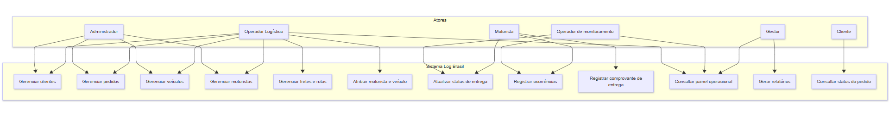
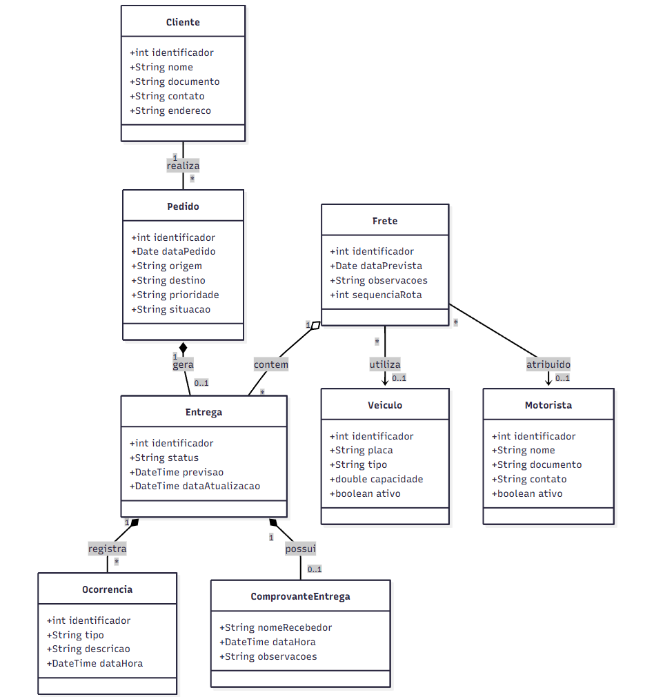

# 3. DOCUMENTO DE ESPECIFICAÇÃO DE REQUISITOS DE SOFTWARE

## 3.1 Objetivos deste documento

Descrever e especificar as necessidades do processo de gestão de entregas que devem ser atendidas pelo projeto Log Brasil – Sistema de Gestão de Entregas, visando otimizar o controle logístico, o acompanhamento das entregas e a organização das operações de transporte.

## 3.2 Escopo do produto

### 3.2.1 Nome do produto e seus componentes principais

O produto será denominado Log Brasil – Sistema de Gestão de Entregas. Trata-se de uma aplicação voltada ao apoio das operações logísticas, sendo composta por módulos responsáveis pelo cadastro de clientes, pedidos e veículos, além de um módulo de controle das entregas. O sistema permitirá registrar, organizar e acompanhar as informações relacionadas às atividades de distribuição, oferecendo uma estrutura simples e eficiente para o gerenciamento das operações.

### 3.2.2 Missão do produto

A missão do Log Brasil é proporcionar maior controle, organização e eficiência nas operações de entrega, por meio da centralização das informações e do acompanhamento das atividades logísticas. O sistema busca reduzir falhas operacionais, facilitar o acesso aos dados e apoiar o usuário na gestão das entregas, contribuindo para um processo mais ágil, seguro e estruturado.

### 3.2.3 Limites do produto

O Log Brasil não contempla controle financeiro, faturamento, integração com sistemas externos ou rastreamento em tempo real via GPS. O sistema é voltado apenas para o cadastro e gerenciamento básico das entregas, não atendendo múltiplas empresas ou operações logísticas complexas.

### 3.2.4 Benefícios do produto

| #  | Benefício                                     | Valor para o Cliente |
|----|-----------------------------------------------|----------------------|
| 1  | Cadastro rápido de clientes e pedidos         | Essencial            |
| 2  | Consulta ágil de informações                  | Essencial            |
| 3  | Controle eficiente das entregas               | Essencial            |
| 4  | Organização das operações logísticas          | Recomendável         |
| 5  | Redução de erros no processo                  | Essencial            |
| 6  | Aumento da produtividade operacional          | Recomendável         |
| 7  | Visibilidade do andamento das entregas        | Essencial            |
| 8  | Centralização dos dados logísticos            | Essencial            |
| 9  | Suporte à tomada de decisão                   | Recomendável         |
| 10 | Melhoria na qualidade do serviço              | Recomendável         |

## 3.3 Descrição geral do produto

### 3.3.1 Requisitos Funcionais

| Código | Requisito Funcional | Descrição |
|--------|--------------------|-----------|
| RF1 | Gerenciar Clientes | Permitir inclusão, alteração, exclusão e consulta de clientes |
| RF2 | Gerenciar Pedidos | Permitir inclusão, alteração, exclusão e consulta de pedidos |
| RF3 | Gerenciar Veículos | Permitir inclusão, alteração, exclusão e consulta de veículos |
| RF4 | Gerenciar Entregas | Permitir registrar e controlar as entregas realizadas |
| RF5 | Gerenciar Motoristas | Permitir inclusão, alteração, exclusão e consulta de Motoristas/Entregadores |
| RF6 | Consultar Clientes | Permitir visualizar e consultar clientes cadastrados |
| RF7 | Consultar Pedidos | Permitir visualizar e consultar pedidos cadastrados |
| RF8 | Consultar Veículos | Permitir visualizar e consultar veículos cadastrados |
| RF9 | Consultar Entregas | Permitir visualizar e consultar entregas cadastradas |
| RF10 | Consultar Motoristas | Permitir visualizar e consultar motoristas cadastrados |
| RF11 | Atualizar Status de Entrega | Permitir atualizar o status das entregas (pendente, em andamento, concluída) |
| RF12 | Registrar Ocorrências | Permitir registrar ocorrências relacionadas às entregas |
| RF13 | Gerar Relatórios | Permitir a geração de relatórios básicos das entregas |
| RF14 | Planejar rotas | Sugerir e registrar sequencia de entregas por frete para apoio operacional. |
| RF15 | Registrar comprovante de entrega | Permitir registro de evidencias (nome do recebedor, data/hora e observacoes). |
| RF16 | Consultar painel operacional | Exibir visao consolidada de fretes e entregas com filtros por periodo, cliente e status. |
| RF17 | Atribuir recursos de transporte | Vincular motorista e veiculo ao frete antes da saida para entrega. |

### 3.3.2 Requisitos Não Funcionais

| Código | Requisito Não Funcional | Descrição |
|--------|--------------------|-----------|
| RNF1 | Acesso Web | Ser acessado via navegador web |
| RNF2 | Interface Simples | Possuir interface intuitiva e de fácil utilização |
| RNF3 | Segurança de Acesso | Garantir segurança por meio de login e senha |
| RNF4 | Armazenamento Seguro | Armazenar os dados de forma segura em banco de dados |
| RNF5 | Desempenho | Responder a consultas principais (lista de pedidos, fretes e entregas) em um tempo de até dois segundos para uso operacional |
| RNF6 | Compatibilidade de Navegadores | Ser compatível com os principais navegadores (Chrome, Edge, etc.)|
| RNF7 | Usabilidade | Permitir execução das tarefas principais com fluxo claro e linguagem objetiva |
| RNF8 | Manutenibilidade | Permitir fácil manutenção e atualização |
| RNF9 | Backup de Dados | Possuir backup periódico dos dados |
| RNF10 | Integridade de Dados | Garantir integridade das informações armazenadas |
| RNF11 | Responsividade | Responsivo para diferentes tamanhos de tela |
| RNF12 | Registro de Logs | Registrar logs básicos de operações realizadas |

### 3.3.3 Usuários 

| Ator | Descrição |
|------|-----------|
| Administrador | Usuário responsável pelo gerenciamento geral do sistema, incluindo cadastro e manutenção de dados. Possui acesso completo. |
| Operador Logístico | Usuário responsável pelo cadastro de pedidos, clientes e controle das entregas. |
| Motorista | Usuário responsável por visualizar suas entregas e atualizar o status das mesmas. |
| Gestor | Usuário responsável por acompanhar as operações e analisar relatórios das entregas. |
| Cliente | Usuário que pode consultar o status de suas entregas. |
| Operador de monitoramento | Usuario responsavel por acompanhar entregas em andamento, tratar excecoes e apoiar replanejamento. |

## 3.4 Modelagem do Sistema

### 3.4.1 Diagrama de Casos de Uso

O diagrama da Figura 1 representa as principais interações entre os atores do Log Brasil e o sistema. O **Administrador** concentra funções de configuração e cadastros gerais. O **Operador Logístico** trata de pedidos, fretes, planejamento de rota e atribuição de motorista e veículo. O **Motorista** executa a rota, atualiza status e registra ocorrências e comprovantes. O **Operador de monitoramento** acompanha entregas em andamento e apoia exceções. O **Gestor** consulta painéis e relatórios. O **Cliente** (quando previsto no escopo) consulta o status de seus pedidos.

Os casos de uso estão agrupados de forma lógica: cadastros base (clientes, pedidos, veículos, motoristas), operação (frete, rota, atribuição, entrega, status, ocorrências, comprovante), consulta (painel) e gestão (relatórios).

#### Figura 1: Diagrama de Casos de Uso do Sistema Log Brasil.

### 3.4.2 Descrições de Casos de Uso

A seguir estão descrições textuais de casos de uso centrais do domínio logístico, alinhados aos requisitos funcionais da Seção 3.3.1.

#### Gerenciar fretes e planejar rota (CSU01)

**Sumário:** O Operador Logístico cria um frete, associa pedidos e define a sequência de entregas (rota) para apoio operacional.

**Ator primário:** Operador Logístico.

**Ator secundário:** Sistema.

**Pré-condições:** O usuário está autenticado com perfil adequado; existem pedidos cadastrados em situação que permita inclusão em frete.

**Fluxo principal:**

1. O Operador Logístico solicita a criação de um novo frete.
2. O Sistema exibe formulário para dados do frete (identificação, período previsto, observações).
3. O Operador Logístico informa os dados e confirma.
4. O Sistema registra o frete e apresenta a opção de associar pedidos.
5. O Operador Logístico seleciona os pedidos a incluir no frete.
6. O Sistema valida disponibilidade dos pedidos e associa-os ao frete.
7. O Operador Logístico define a ordem das paradas (sequência da rota).
8. O Sistema persiste a sequência e exibe o resumo do frete.

**Fluxo alternativo (5–6) – Pedido indisponível:** Se um pedido não puder ser associado (já em outro frete ativo ou status incompatível), o Sistema informa o motivo e o Operador Logístico ajusta a seleção.

**Pós-condições:** O frete existe, contém pedidos vinculados e possui ordem de rota definida (ou pendente de ajuste posterior).

#### Atribuir motorista e veículo ao frete (CSU02)

**Sumário:** O Operador Logístico vincula motorista e veículo ao frete antes da saída para entrega.

**Ator primário:** Operador Logístico.

**Pré-condições:** Frete cadastrado; motorista e veículo cadastrados e aptos ao uso.

**Fluxo principal:**

1. O Operador Logístico localiza o frete desejado.
2. O Operador Logístico solicita atribuição de recursos.
3. O Sistema exibe listas de motoristas e veículos disponíveis conforme filtros.
4. O Operador Logístico seleciona um motorista e um veículo e confirma.
5. O Sistema valida consistência (ex.: veículo ativo, motorista habilitado) e grava a atribuição.

**Pós-condições:** O frete fica associado a motorista e veículo para execução.

#### Atualizar status de entrega (CSU03)

**Sumário:** O Motorista (ou Operador de monitoramento, conforme permissão) altera o status das entregas do frete (por exemplo: pendente, em andamento, concluída, atrasada).

**Atores primários:** Motorista; Operador de monitoramento.

**Pré-condições:** Usuário autenticado; entrega vinculada a frete atribuído ao motorista (quando aplicável).

**Fluxo principal:**

1. O ator acessa a lista de entregas do frete ou do dia.
2. O ator seleciona uma entrega e solicita alteração de status.
3. O Sistema exibe os status permitidos para aquela entrega.
4. O ator escolhe o novo status e confirma.
5. O Sistema valida a transição, registra data/hora e atualiza o painel.

**Fluxo alternativo – Transição inválida:** O Sistema informa que a mudança não é permitida e mantém o status anterior.

**Pós-condições:** O status da entrega reflete o estado atual da operação.

#### Registrar ocorrência na entrega (CSU04)

**Sumário:** O Motorista ou o Operador de monitoramento registra um imprevisto relacionado à entrega.

**Atores primários:** Motorista; Operador de monitoramento.

**Pré-condições:** Entrega identificável no sistema.

**Fluxo principal:**

1. O ator seleciona a entrega e solicita registro de ocorrência.
2. O Sistema apresenta formulário (tipo, descrição, data/hora).
3. O ator preenche e confirma.
4. O Sistema armazena a ocorrência e a associa à entrega.

**Pós-condições:** A ocorrência fica disponível para consulta no histórico da entrega e em relatórios.

#### Gerar relatório de entregas (CSU05)

**Sumário:** O Gestor gera relatório consolidado de entregas com filtros por período, cliente e status.

**Ator primário:** Gestor.

**Pré-condições:** Usuário autenticado com perfil de Gestor.

**Fluxo principal:**

1. O Gestor acessa a funcionalidade de relatórios.
2. O Gestor define filtros (período, cliente, status).
3. O Sistema processa e exibe o relatório ou exportação disponível.
4. O Gestor pode ajustar filtros e repetir a consulta.

**Pós-condições:** Os dados apresentados correspondem aos critérios informados.

### 3.4.3 Diagrama de Classes

A Figura 2 apresenta o modelo conceitual principal do domínio. Um **Cliente** realiza vários **Pedidos**. Vários pedidos podem ser agrupados em um **Frete**, que possui **Motorista** e **Veículo** atribuídos. Cada vínculo pedido–frete em execução é representado por uma **Entrega**, que possui **status**, pode registrar várias **Ocorrencia** e um **ComprovanteEntrega** quando concluída. Essa estrutura atende aos requisitos de cadastro, fretes, rotas, atribuição, status, ocorrências e comprovante descritos na Seção 3.3.1.

#### Figura 2: Diagrama de Classes do Sistema.
 
 

### 3.4.4 Descrições das Classes

| # | Nome | Descrição |
|---|------|-----------|
| 1 | Cliente | Representa o contratante ou destinatário cadastrado, com dados de identificação, contato e endereço utilizados nos pedidos e entregas. |
| 2 | Pedido | Solicitação de transporte com origem, destino, prioridade e situação no processo logístico antes ou durante a alocação a um frete. |
| 3 | Veiculo | Meio de transporte disponível para execução de fretes, com identificação, tipo, capacidade e indicador de uso. |
| 4 | Motorista | Profissional responsável pela condução e execução das entregas do frete, com dados cadastrais e situação ativa ou inativa. |
| 5 | Frete | Agrupamento operacional de entregas com sequência de rota planejada e vínculo opcional a motorista e veículo. |
| 6 | Entrega | Instância operacional de um pedido dentro de um frete, com status ao longo do ciclo (pendente, em andamento, concluída, atrasada, cancelada). |
| 7 | Ocorrencia | Registro de imprevistos ou observações ligados a uma entrega (tipo, descrição e momento). |
| 8 | ComprovanteEntrega | Evidência de conclusão da entrega, com nome do recebedor, data/hora e observações, quando aplicável. |